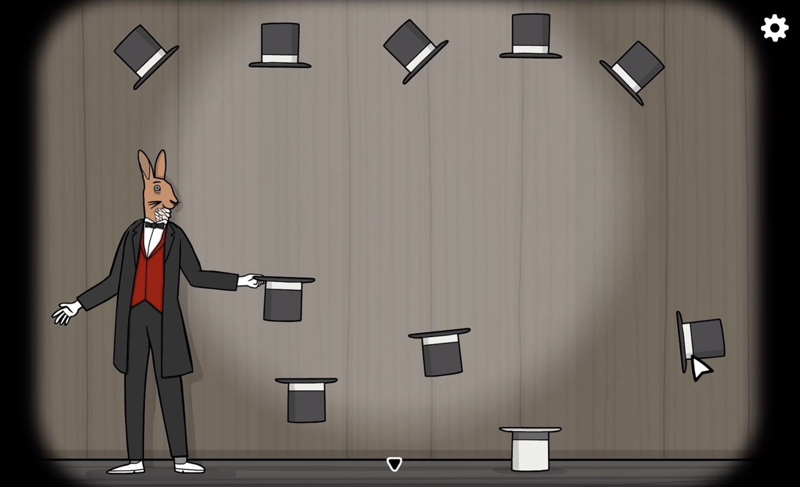
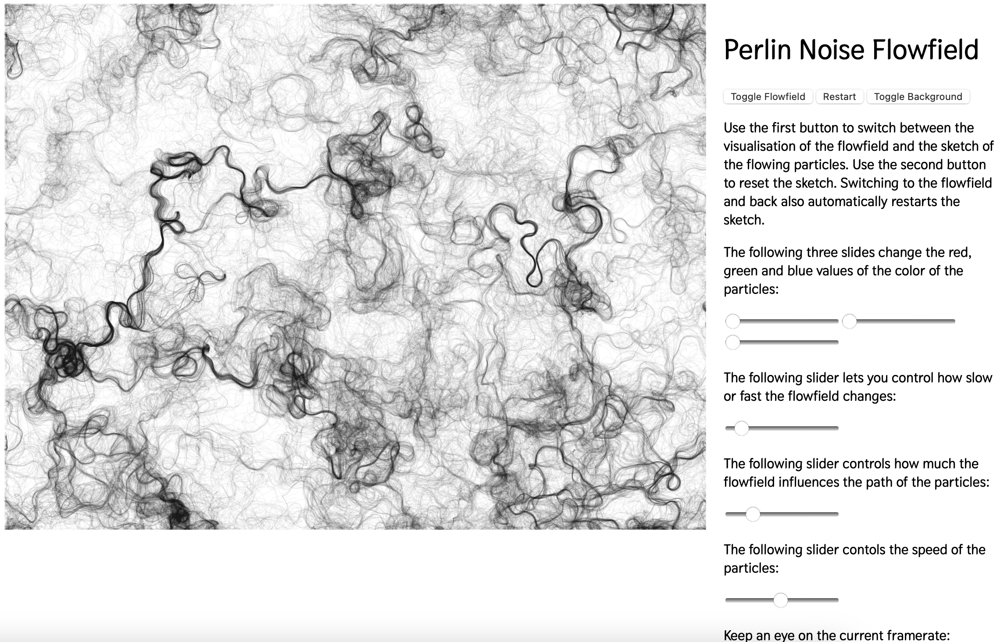

# Quiz 8: Imaging Technique Inspiration

## Part 1: Imaging Technique Inspiration

These two games both use simple visual design and subtle interaction to create a strong atmosphere. In Limbo, I’m inspired by the silhouette style, soft background movement, and layered environments, which make the world feel immersive without detailed graphics. In Rusty Lake, I like the minimal but effective interaction design, where small object movements and simple mechanics create curiosity and engagement. I would like to combine atmospheric environmental motion with simple interactive elements in my project. These techniques are beneficial because they create an engaging visual experience while still being achievable within the scope of a creative coding assignment.

## Part 2: Coding Technique Exploration

I explored the use of Perlin noise and flow field animation to create soft and natural movement. Unlike completely random motion, flow fields create smoother and more organic animation, which is useful for environmental effects such as moving fog, drifting particles, or subtle background motion. I chose this technique because it matches the atmospheric visual style I explored in Part 1, especially the layered movement and immersive feeling seen in Limbo. It can help create simple but engaging animated environments while still being achievable within the scope of a creative coding assignment.

### Example Code Link
https://nilsde.github.io/flowfield/